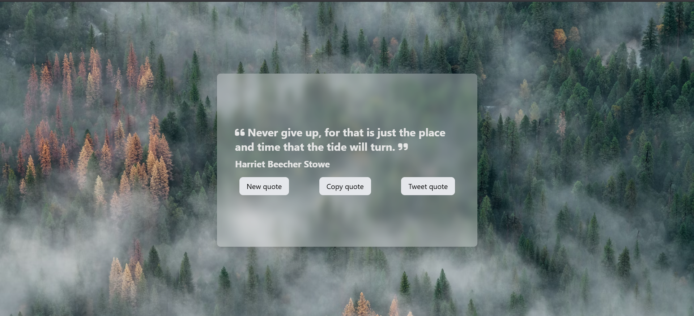

# Random Quote Generator

A simple web application that displays random inspirational quotes with a beautiful background. Users can get new quotes, copy them to clipboard, or share them directly on Twitter.



## Features

- Fetches random quotes from an external API
- Displays quotes with author attribution
- Aesthetically pleasing UI with background from Unsplash
- Responsive design that works on all devices
- Functionality to get new quotes with a button click
- Copy quotes to clipboard
- Share quotes directly to Twitter

## Technologies Used

- HTML5
- CSS3 with Tailwind CSS
- JavaScript (ES6+)
- Font Awesome icons
- External APIs:
  - FreeAPI for quotes
  - Unsplash for background images

## Installation and Setup

1. Clone the repository:

   ```
   git clone https://github.com/yourusername/get-random-quots.git
   cd get-random-quots
   ```

2. No build process is required as this is a simple HTML/JS application.

3. Open `index.html` in your browser to run the application locally.

## Usage

- Click the "New quote" button to fetch and display a new random quote
- Click the "Copy quote" button to copy the current quote to your clipboard
- Click the "Tweet quote" button to share the quote on Twitter
